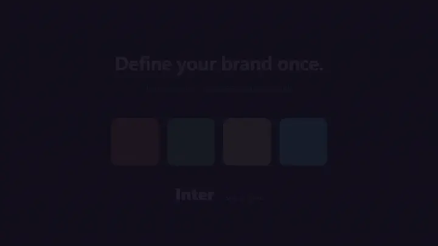

<div align="center">

# atelier

**Design-automation plugin for Claude Code.** Define your brand once — every skill uses it.

[](./LICENSE)
[](https://github.com/EthanY33/atelier/releases)
[](https://docs.claude.com/claude-code)
[](https://github.com/EthanY33/atelier/actions/workflows/ci.yml)



</div>

---

## What's in the box

Seven skills, one source of truth.

| Skill | What it does |
|---|---|
| **brand-memory** | Maintains `.atelier/brand.json` — the source of truth for palette, typography, logos, voice, and deploy targets. Every other skill reads from it. |
| **design-token-sync** | Pushes brand-memory → `tokens.css`, `tailwind.config.js`, `tokens.d.ts`, and Figma variables. One command, four destinations. |
| **og-card-generator** | Generates 1200×630 Open Graph + Twitter card PNGs per page, rendered from a branded HTML template. |
| **responsive-image-pipeline** | Converts source PNG/JPG → AVIF + WebP at 480/768/1280/1920px + base64 LQIP placeholder + copy-pasteable `<picture>` snippet. SHA-cached. |
| **brand-asset-pipeline** | One `mark.svg` → full favicon set, app icons, social covers, and optional Steam capsules. |
| **accessibility-design-audit** | Runs WCAG AA checks (axe-core + Playwright) on a URL or local HTML, emits markdown report + screenshots. CI-friendly exit codes. |
| **html-to-video** | Records any HTML page as MP4 (H.264) or WebM (VP9) via Playwright + ffmpeg. Includes GIF recipe. This README's hero GIF was made with it. |

## Install

```
/plugin marketplace add EthanY33/atelier
/plugin install atelier@atelier
```

Then try the full pipeline in ~45 seconds:

```
/atelier-demo
```

That command runs all seven skills end-to-end against bundled fixtures and prints the output tree.

## Quickstart: your first brand

```
/brand-init
```

Interactive bootstrap — answers a handful of prompts and writes `.atelier/brand.json` in your project. After that:

```
/brand-set palette.terra "#e07a5f"
/brand-get palette.terra
/brand-audit
```

Then run any skill — all of them read from the same `.atelier/brand.json`.

## Philosophy: one brand, many outputs

Most design-automation tools own a slice: Tailwind has colors, sharp has images, Playwright has screenshots, axe has a11y. atelier is the layer above — it treats **brand** as a first-class persistent object (`.atelier/brand.json`), and wires every downstream artifact to it. Change a hex code once; regenerate tokens, OG cards, favicons, and audit results together.

Other design decisions:

- **JSON, not YAML.** Claude edits the file via slash commands, so human ergonomics of YAML buy nothing; JSON is stdlib-parseable and produces cleaner diffs.
- **Skills are self-contained.** Each `plugins/atelier/skills/<name>/` directory is copyable on its own if you only want one skill.
- **Preflight checks.** Every entrypoint verifies its binary dependencies (sharp native, ffmpeg, Playwright browsers) and prints install instructions on miss.
- **MIT, no telemetry.** Fork it, ship it, sell it.

## Documentation

- [Getting started](docs/getting-started.md)
- [Skill reference](docs/skill-reference.md)
- [QA checklist](docs/qa-checklist.md)
- [Contributing](docs/contributing.md)
- [Changelog](CHANGELOG.md)

## Requirements

- **Claude Code** ≥ 1.0
- **Node.js** ≥ 20 LTS
- **ffmpeg** in PATH (for `html-to-video` only — `choco install ffmpeg` / `brew install ffmpeg` / `apt install ffmpeg`)
- **Playwright Chromium** (installed automatically on first `npm install`)

## Development

```
git clone https://github.com/EthanY33/atelier
cd atelier
npm install
npm test            # vitest, 52 tests (3 skipped if ffmpeg not present)
npm run lint:schemas
npm run demo        # run /atelier-demo locally
npm run demo:gif    # regenerate demos/overview.gif
```

CI runs on Ubuntu + Windows matrix (Node 20) with a 70% coverage gate. See `.github/workflows/ci.yml`.

## License

[MIT](./LICENSE) © 2026 Ethan Y.
