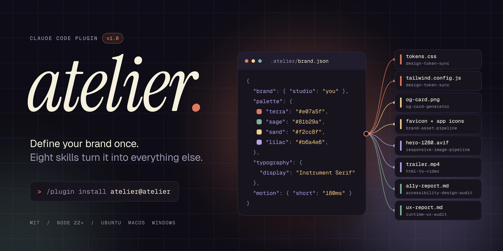
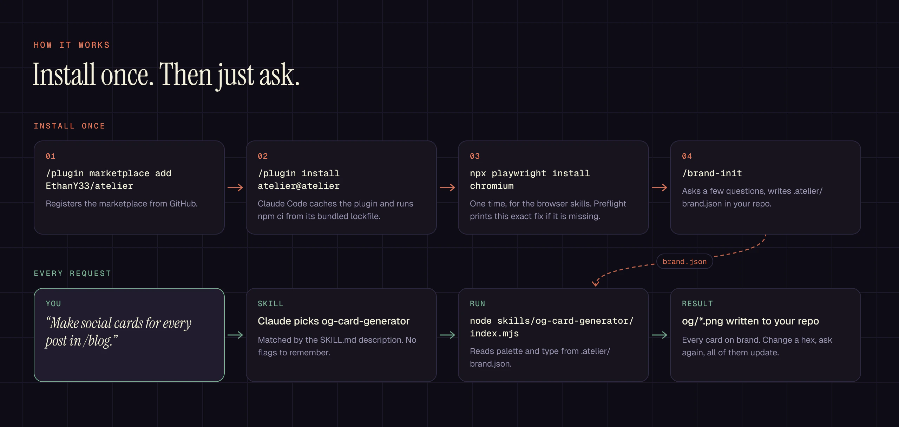
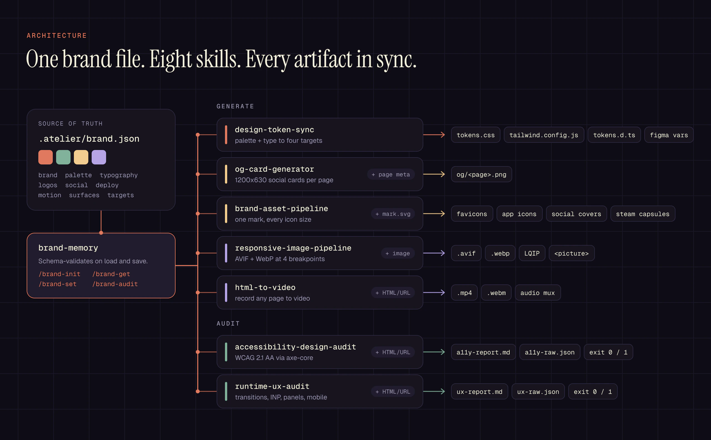
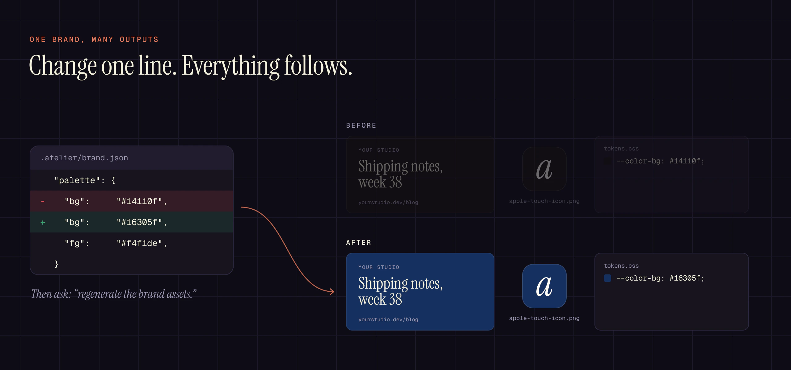
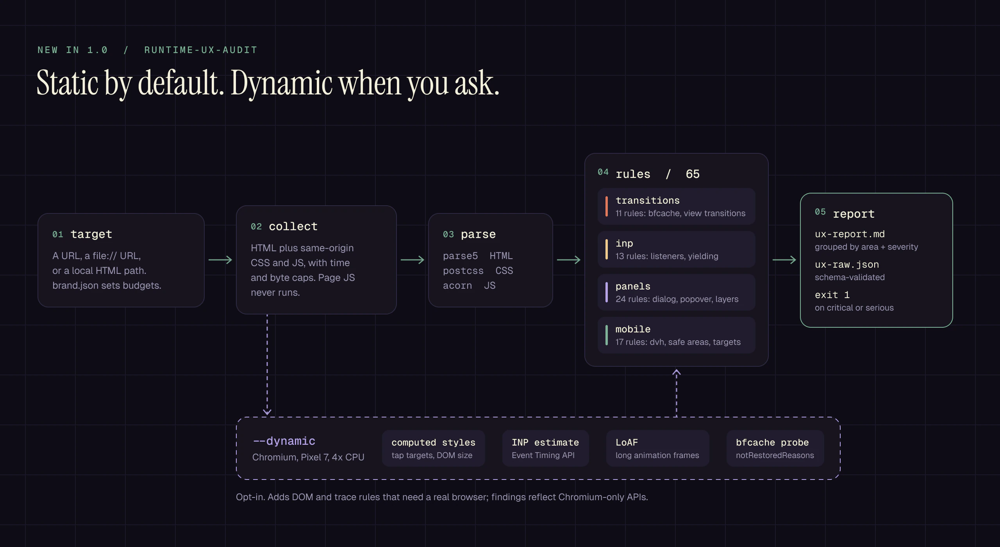

<div align="center">

<picture>
  <source media="(prefers-color-scheme: dark)" srcset="docs/assets/hero-dark.webp">
  <source media="(prefers-color-scheme: light)" srcset="docs/assets/hero-light.webp">
  
</picture>

[](https://github.com/EthanY33/atelier/releases)
[](https://github.com/EthanY33/atelier/actions/workflows/ci.yml)
[](./LICENSE)
[](https://code.claude.com/docs/en/plugins)
[](https://nodejs.org)

**Design automation for Claude Code.** One `.atelier/brand.json` drives your design tokens, social cards,<br>
icons, responsive images and video, and two audits keep the shipped page honest.

[Install](#install) &nbsp;/&nbsp; [The eight skills](#the-eight-skills) &nbsp;/&nbsp; [runtime-ux-audit](#new-in-10-runtime-ux-audit) &nbsp;/&nbsp; [CI](#use-it-in-ci) &nbsp;/&nbsp; [Docs](docs/)

</div>

---

## Install

In Claude Code:

```
/plugin marketplace add EthanY33/atelier
/plugin install atelier@atelier
```

Claude Code installs the plugin's Node dependencies for you. Then:

```
/atelier-doctor      checks Node, dependencies, Chromium, ffmpeg and your brand file
/brand-init          a few questions, then writes .atelier/brand.json
```

The browser skills need Playwright's Chromium once. `/atelier-doctor` prints the exact command for your version (`npx playwright@<version> install chromium`). `html-to-video` also needs `ffmpeg` on your PATH.

<picture>
  <source media="(prefers-color-scheme: dark)" srcset="docs/assets/how-it-works-dark.webp">
  <source media="(prefers-color-scheme: light)" srcset="docs/assets/how-it-works-light.webp">
  
</picture>

After that you just ask. *"Make social cards for every post in /blog."* *"Audit the pricing page for mobile problems."* *"Regenerate the favicons from the new mark."* Claude picks the skill from its description; there are no flags to memorize.

## The eight skills

<picture>
  <source media="(prefers-color-scheme: dark)" srcset="docs/assets/architecture-dark.webp">
  <source media="(prefers-color-scheme: light)" srcset="docs/assets/architecture-light.webp">
  
</picture>

| Skill | Ask Claude | Or run | Writes |
|---|---|---|---|
| **brand-memory** | "set up our brand" | `atelier brand` | `.atelier/brand.json`, schema-validated on every load and save |
| **design-token-sync** | "sync the brand into Tailwind" | `atelier tokens` | `tokens.css`, `tailwind.config.js`, `tokens.d.ts`, Figma variables |
| **og-card-generator** | "social cards for every blog post" | `atelier og` | 1200x630 PNG per page |
| **brand-asset-pipeline** | "favicons and app icons from mark.svg" | `atelier assets` | favicons, app icons, social covers, Steam capsules |
| **responsive-image-pipeline** | "make the hero images responsive" | `atelier images` | AVIF + WebP at 480 to 1920px, LQIP, a `<picture>` snippet |
| **html-to-video** | "record the landing page as a 10 second clip" | `atelier video` | MP4 (H.264) or WebM (VP9), optional audio track |
| **accessibility-design-audit** | "check this page against WCAG AA" | `atelier a11y` | `a11y-report.md` + raw axe JSON, CI exit code |
| **runtime-ux-audit** | "audit the pricing page for mobile problems" | `atelier ux` | `ux-report.md` + `ux-raw.json`, CI exit code |

Every skill is also a plain Node module and a CLI, so the same work runs in scripts and CI. The full contract for each is in [docs/api.md](docs/api.md).

## See it run


<sub>A reconstructed Claude Code session: each command shows its real output (paths shortened), the four fixes are the smallest edits that clear the audit, and every card and icon was generated by atelier for a demo brand. [Watch it with sound (MP4)](demos/atelier-1.0-trailer.mp4). Built frame by frame from [`demos/trailer`](demos/trailer/index.html) with `npm run demo:trailer`.</sub>

## One brand, many outputs

<picture>
  <source media="(prefers-color-scheme: dark)" srcset="docs/assets/propagation-dark.webp">
  <source media="(prefers-color-scheme: light)" srcset="docs/assets/propagation-light.webp">
  
</picture>

Most design tooling owns one slice: Tailwind has colors, sharp has images, Playwright has screenshots, axe has accessibility. atelier sits one layer up and treats the **brand** as the object that persists. Every artifact is derived from it, so a rebrand is a one-line diff and a regenerate, not a scavenger hunt.

```jsonc
// .atelier/brand.json
{
  "$schema": "https://raw.githubusercontent.com/EthanY33/atelier/main/plugins/atelier/schemas/brand.schema.json",
  "brand":      { "studio": "goneIdle", "product": "TideWane", "voice": ["pithy", "briny"] },
  "palette":    { "bg": "#110f1b", "accent": "#e07a5f", "sage": "#81b29a", "sand": "#f2cc8f" },
  "typography": { "display": "Instrument Serif, serif", "body": "Inter, system-ui, sans-serif" },
  "logos":      { "mark": "brand/mark.svg" },
  "motion":     { "duration": { "short": "180ms", "medium": "240ms" } },
  "targets":    { "minTapPx": 44, "inpBudgetMs": 200 }
}
```

The `$schema` line gives you autocomplete and validation in VS Code and other JSON-schema-aware editors.

## New in 1.0: runtime-ux-audit

<picture>
  <source media="(prefers-color-scheme: dark)" srcset="docs/assets/runtime-ux-dark.webp">
  <source media="(prefers-color-scheme: light)" srcset="docs/assets/runtime-ux-light.webp">
  
</picture>

Accessibility audits tell you whether a page is *correct*. `runtime-ux-audit` tells you whether it *feels* right: how it transitions, how fast it answers input, how its dialogs and popovers behave, and how it holds up on a phone. 65 rules across four areas, each with a detection written down in the [spec](docs/specs/runtime-ux-audit.md) and a fixture that must trigger it and one that must not.

| Area | Catches, for example |
|---|---|
| **transitions** | `unload` handlers that evict the page from the back/forward cache, view transitions without a reduced-motion guard |
| **inp** | non-passive scroll and touch listeners, `setTimeout(fn, 0)` used as a yield, forced layout inside click handlers |
| **panels** | `z-index: 9999` layers, `<div role="dialog">` where `<dialog>` would do, `backdrop-filter` over a playing video |
| **mobile** | `100vh` without a `dvh` fallback, safe-area insets without `viewport-fit=cover`, tap targets under 24px |

The static pass parses HTML, CSS and JS without executing anything and finishes in seconds, so it belongs on every pull request. Add `--dynamic` to load the page in Chromium as a Pixel 7 with a 4x CPU throttle, script interactions, estimate INP from the Event Timing API, and probe the back/forward cache. Budgets come from `targets`, `motion` and `surfaces` in your brand file, with Core Web Vitals and WCAG 2.2 defaults.

## Use it in CI

Both audits exit `1` on critical or serious findings, `0` when clean, and `2` when they could not run. The repo doubles as a GitHub Action:

```yaml
- uses: actions/checkout@v7
- run: npm ci && npm run build          # whatever produces your HTML
- uses: EthanY33/atelier@v1
  with:
    target: dist/index.html             # a path, file:// URL, or http(s) URL
    audits: a11y,ux                     # default
    dynamic: false                      # true adds the Chromium pass
    brand: .atelier/brand.json          # optional budgets
```

Both reports are appended to the job summary and written to `atelier-reports/`. The action uses the job's Node when it is 22 or newer and installs Node 22 otherwise. Outside GitHub, the same checks run with `atelier a11y <target>` and `atelier ux <target>`.

## Commands and CLI

| Slash command | What it does |
|---|---|
| `/brand-init` | Interview, then write `.atelier/brand.json` |
| `/brand-get <path>` / `/brand-set <path> <value>` | Read or change one field, validated |
| `/brand-audit` | List recommended fields that are still missing |
| `/ux-audit <url-or-file>` | Run `runtime-ux-audit` and summarize the fixes |
| `/atelier-doctor` | Check the environment and offer the fix for anything missing |
| `/atelier-demo` | Run every skill on bundled fixtures into `./atelier-demo` |

Inside a Claude Code session the plugin's `bin/` is on the PATH, so `atelier doctor`, `atelier demo` and `atelier <skill> --help` work directly.

## Proven on a real site

atelier was built for and dogfooded on [goneidle.com](https://goneidle.com) before its first release: 3.89 MB of site PNGs became 167 KB of 1280px AVIF, zero critical or serious WCAG AA violations, and OG cards, favicons and tokens regenerated from the same brand file. The `backdrop-filter` rules in `runtime-ux-audit` come from a modal-stutter fix on that site.

## Stability

1.0 is a promise about these surfaces, which follow [semver](https://semver.org) from here on:

- each skill's exported functions and CLI flags documented in [docs/api.md](docs/api.md)
- the `.atelier/brand.json` schema (1.x only adds optional fields)
- the `ux-raw.json` format (`schemaVersion: "1.0"`) and audit exit codes

## Requirements

- Claude Code with plugin support
- Node.js 22 or newer
- Playwright Chromium for `og-card-generator`, `accessibility-design-audit`, `html-to-video` and `runtime-ux-audit --dynamic`
- `ffmpeg` on PATH for `html-to-video` (`winget install Gyan.FFmpeg`, `brew install ffmpeg`, `apt install ffmpeg`)

## Development

```bash
git clone https://github.com/EthanY33/atelier
cd atelier
npm install                 # also installs the plugin's own dependencies
npm run setup:browsers      # Chromium matching the pinned Playwright
npm test
npm run smoke:plugin        # install the plugin the way Claude Code does, then run it
npm run demo                # every skill against bundled fixtures into ./.atelier-demo
```

CI runs the suite on Ubuntu, macOS and Windows with Node 22 and 24, enforces a 70% coverage gate, validates the plugin with `claude plugin validate`, and repeats a marketplace-style install on every OS. See [CONTRIBUTING](docs/contributing.md) and the [architecture notes](docs/architecture.md).

## License

[MIT](./LICENSE). No telemetry: atelier never phones home.
